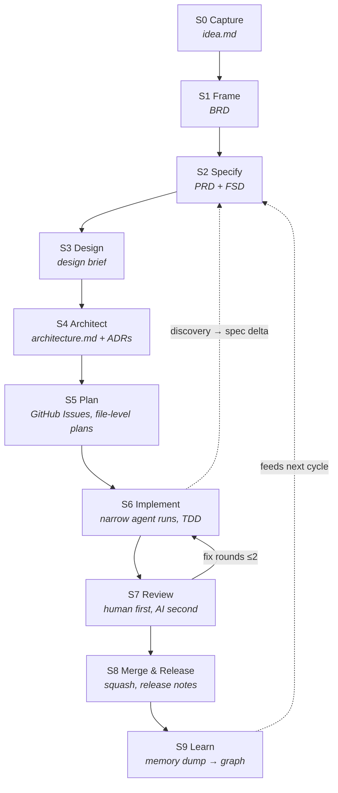

# The Lifecycle — Idea to Production

*The end-to-end workflow. Ten stages, each with an artifact and an exit gate. You are the architect at every gate; agents do the work between them.*

## The shape of the system

Three loops matter:

1. **The fix loop** (S7 → S6): bounded at two rounds. A third round means the spec or the plan was wrong — go back to S5, not deeper into the diff. See [failure-recovery-playbook.md](failure-recovery-playbook.md).
2. **The discovery loop** (S6 → S2): implementation always discovers things the spec missed. Discoveries produce *written spec deltas* — never silent divergence. The agent flags it; you amend the FSD; the ticket updates.
3. **The learning loop** (S9 → everything): every merge feeds the memory system, which makes every future stage cheaper and more accurate.

**The gate principle:** each gate is cheap to pass if the previous stage was done honestly, and expensive to skip. Gates are where *you* work. Everything between gates is where agents work. This is what "architect, not babysitter" means operationally: your time concentrates at decision points, not in transcripts.

**Stage-skipping is sized, not improvised.** A one-line bugfix doesn't need a BRD — and the S1 size-classification table defines exactly which artifacts each class of work gets, so skips are standard rather than ad-hoc. Skipping beyond what your size class allows still requires *saying so in the ticket*, never drifting past it. The lightweight profile in [adoption-plan.md](adoption-plan.md) maps to the XS/S rows.

**Harness names assume the default stack.** This doc says "Claude Code" and "Sonnet/Opus" throughout — that's the [default stack](adoption-plan.md) (Claude Code + Anthropic models). On the **open-frontier stack** (OpenCode + DeepSeek/OpenRouter), every stage maps one-for-one per [harness-matrix.md](harness-matrix.md) — gates, artifacts, skills, and constitution rules are stack-independent.

---

## S0 — Capture

**Purpose:** get ideas out of your head at zero cost, without committing to anything.

| | |
|---|---|
| **Entry** | any idea, any time |
| **Activities** | 5 minutes, tops. Fill [templates/idea.md](templates/idea.md): the problem, who has it, evidence, kill criteria. |
| **Artifact** | `docs/product/ideas/<slug>.md` |
| **Harness** | none, or a chat with Claude to sharpen phrasing. Not worth an agent run. |
| **Exit gate** | none. Ideas sit in the inbox until weekly triage promotes or parks them. |

The kill-criteria field is the important one: writing down *what would make you drop this* at capture time prevents zombie projects.

## S1 — Frame (BRD)

**Purpose:** decide whether this is worth building, in business terms, before any product thinking.

| | |
|---|---|
| **Entry** | an idea promoted at triage |
| **Activities** | the agent interviews *you* using the grill questions embedded in [templates/brd.md](templates/brd.md) — it asks, you answer, it drafts, you edit. The agent's job is to refuse vague answers. |
| **Artifact** | `docs/product/<slug>/brd.md` |
| **Harness** | Claude Code, interactive session |
| **Skills** | `research` (market/competitor input if needed) |
| **Exit gate** | you can state problem, user, outcome, and non-goals in five sentences without reading the doc. Measurable success metric exists. Go/no-go recorded. **Work is size-classified** (table below), which sets the expected artifact depth for every later stage. |

For personal projects the BRD can be a half page. It still exists, because the non-goals section is what keeps S5 tickets from sprawling later.

### Size classification — the spec scales to the work

Classify at S1 exit (or at triage for bugs). The size determines *expected* artifact depth — this replaces ad-hoc stage-skipping with a standard answer, and it prevents the failure mode where a one-line bugfix gets a full PRD because the lifecycle says so:

| Size | Signature | S1 (BRD) | S2 (spec) | S5 (plan) |
|---|---|---|---|---|
| **XS** | ≤1 file, no unknowns, no schema/API change | skip | acceptance criteria in the issue body | file list in the issue body |
| **S** | 1–3 files, one known area | one paragraph in the issue | FSD-lite: flows + ACs + edge cases in the issue | full file-level plan in the issue |
| **M** | 3–5 files, or any schema/API change | half-page BRD | full FSD | full plan, persisted (see S5) |
| **L** | >5 files, architectural impact, or new domain | full BRD | full PRD + FSD | decompose into an S/M ticket train first |

Sizing is a hypothesis: if implementation reveals the size was wrong (an "XS" touches a third file), the ticket bounces up a class and gains the missing artifacts — that's a spec delta, not a failure.

## S2 — Specify (PRD → FSD)

**Purpose:** convert intent into a testable contract. This is the highest-leverage stage in the whole system — spec quality is the ceiling on everything downstream.

| | |
|---|---|
| **Entry** | approved BRD |
| **Activities** | 1) optional `research` spike → `docs/research/` with expiry date. 2) optional `prototype` to de-risk the scary part — prototypes are *throwaway by contract*. 3) draft PRD ([templates/prd.md](templates/prd.md)) — numbered FR-x requirements. 4) draft FSD ([templates/fsd.md](templates/fsd.md)) — flows, states, **EARS requirements** (the five patterns, walked per flow), edge-case table, API contracts, Given/When/Then acceptance criteria keyed to FR ids. 5) **grill the spec**: run `grill-with-docs` so every claimed API and library behavior is verified against real documentation, not the model's memory. |
| **Artifacts** | `docs/product/<slug>/prd.md`, `docs/specs/<slug>/fsd.md`, optionally `docs/research/*.md` |
| **Harness** | Claude Code (frontier model — this is not the stage to save money, see [models-cost-quality.md](models-cost-quality.md)) |
| **Skills** | `research`, `prototype`, `to-spec`, `grill-with-docs` |
| **Exit gate** | every acceptance criterion is mechanically testable. **Every flow has at least one If/Then (unwanted-behaviour) requirement** — walking the five EARS patterns is what *generates* edge cases rather than recalling them. The edge-case table is filled (empty = not thought about ≠ none exist). External API claims carry doc links. You would bet a day of work on this spec being right. |

The FSD is the document agents will actually read during implementation. Write it for a competent contractor with no context: if a requirement needs the conversation to be understood, it isn't written yet.

## S3 — Design

**Purpose:** decide what it looks and feels like before code exists, so UI tickets are executable rather than exploratory.

|                |                                                                                                                                                                                                                                                                                                                          |
| -------------- | ------------------------------------------------------------------------------------------------------------------------------------------------------------------------------------------------------------------------------------------------------------------------------------------------------------------------ |
| **Entry**      | approved FSD (for features with UI; headless work skips to S4 — say so)                                                                                                                                                                                                                                                  |
| **Activities** | fill [templates/design-brief.md](templates/design-brief.md): screens/states inventory tied to FSD flows, tokens, component mapping to shadcn/ui, a11y requirements. Either Figma-first (design there, pull via Figma MCP) or prototype-first (agent builds throwaway HTML mocks, you react, brief captures the verdict). |
| **Artifact**   | `docs/product/<slug>/design-brief.md` + Figma links or `prototypes/`                                                                                                                                                                                                                                                     |
| **Harness**    | Claude Code + Figma MCP, or v0-style generation for direction-finding                                                                                                                                                                                                                                                    |
| **Skills**     | `prototype`                                                                                                                                                                                                                                                                                                              |
| **Exit gate**  | every screen and state in the FSD has a design decision. Empty/loading/error states included — these are what agents invent badly when unspecified.                                                                                                                                                                      |

## S4 — Architect

**Purpose:** make the decisions that are expensive to reverse, and write them down so agents can't unmake them.

|                |                                                                                                                                                                                                                                                                                                                                                                                                        |
| -------------- | ------------------------------------------------------------------------------------------------------------------------------------------------------------------------------------------------------------------------------------------------------------------------------------------------------------------------------------------------------------------------------------------------------ |
| **Entry**      | spec'd feature that touches architecture, or a new repo                                                                                                                                                                                                                                                                                                                                                |
| **Activities** | 1) `domain-modeling`: nail the ubiquitous language — entity names agents must use, recorded in AGENTS.md. 2) update `docs/architecture/architecture.md` ([template](templates/architecture.md)). 3) one [ADR](templates/adr.md) per irreversible choice, each with an *agent instruction* line and a mechanical compliance check. 4) stack per [tech-stack.md](tech-stack.md) — deviations get an ADR. |
| **Artifacts**  | `docs/architecture/architecture.md`, `docs/adr/NNNN-*.md`                                                                                                                                                                                                                                                                                                                                              |
| **Harness**    | Claude Code, frontier model, plan mode for exploring options                                                                                                                                                                                                                                                                                                                                           |
| **Skills**     | `domain-modeling`, `improve-codebase-architecture` (for existing repos)                                                                                                                                                                                                                                                                                                                                |
| **Exit gate**  | ADRs accepted. Data model reviewed by you, line by line — schema mistakes are the most expensive agent mistakes. New repo: repo bootstrapped per [github-setup.md](github-setup.md), AGENTS.md written.                                                                                                                                                                                                |

## S5 — Plan (Ticket decomposition)

**Purpose:** convert the FSD into tickets so well-specified that implementation is almost mechanical. **This is where you spend the time you saved by not babysitting agents.**

| | |
|---|---|
| **Entry** | approved FSD + architecture |
| **Activities** | run `to-tickets`: decompose into GitHub Issues using [task.yml](github/ISSUE_TEMPLATE/task.yml). Every ticket gets: linked spec section, **file/function-level implementation plan**, out-of-scope list, Given/When/Then acceptance criteria, test plan, size XS/S/M. Order with sub-issues/dependencies. You review every plan — this review is 10x cheaper than reviewing the diff that a bad plan produces. |
| **Artifacts** | GitHub Issues labeled `ai:ready`, sequenced in the Delivery project; for M-size work, the plan **persisted to `docs/specs/<slug>/plan.md`** |
| **Harness** | Claude Code against the repo (it must read actual code to name actual files); Spec Kit `/speckit.tasks` is the managed alternative for this exact step — see [harness-matrix.md](harness-matrix.md) |
| **Skills** | `to-tickets`, `wayfinder` (locate the right code first) |
| **Exit gate** | every ticket ≤1 day (size M max; `size:split-me` means split it). File lists name real files. No ticket depends on an unmade decision — those get `needs-decision` and stop here. **The plan is persisted before S6 begins** — M-size: `docs/specs/<slug>/plan.md`; XS/S: the issue body is the persistence. You'd stake a code review on each plan being right. |

**Why persistence is a gate, not a habit:** the plan lives outside any session. Sessions truncate, compact, and die — a plan that exists only in the conversation that produced it is lost the moment context rolls over, and the fix loop's "bounce back to S5" only works if there's a frozen S5 artifact to bounce back *to*. The persisted plan is also what the `converge` gate grades against at S7: frozen before implementation, it can't be quietly rewritten to match whatever got built.

## S6 — Implement

**Purpose:** turn one ticket into one reviewable PR, with the smallest context that suffices.

| | |
|---|---|
| **Entry** | ticket labeled `ai:ready`, its dependencies merged |
| **Activities** | one issue = one branch (`feat/123-slug`) = one PR. Launch a **fresh** Claude Code session per ticket: context = AGENTS.md + the ticket + linked FSD section + files in the plan. Nothing else. TDD per the `tdd` skill: failing test first, then implementation, per [constitution](constitution.md) testing rules. Agent self-reviews its own diff and posts the self-review comment before requesting review. WIP limit: **2 concurrent interactive runs**. Two non-interactive lanes exist for the right work (below): async XS and batch mechanical. |
| **Artifacts** | a PR ≤400 lines, linked `closes #123`, CI green, self-review comment posted |
| **Harness** | Claude Code (primary); Claude Code on the web / Routines, Copilot coding agent, or Codex Web (async XS — governed by **C37**); Codex CLI (second implementation when you want to compare approaches) |
| **Skills** | `implement`, `tdd`, `diagnosing-bugs` (when tests fail unexpectedly) |
| **Exit gate** | CI green, PR template complete, diff touches only planned files (deviations flagged per constitution). |

**Async lane (XS only):** fully-specified XS tickets with *no unknowns* can run unattended — Claude Code on the web / Routines, Copilot coding agent, or Codex Web. You come back to a PR and run the normal S7 pipeline. Anything needing judgment runs interactively; C37 limits what unattended sessions may do.

**Batch lane (mechanical migrations):** the same transformation across N files runs as a monitored `claude -p` / `opencode -p` loop — one commit per file, first 2–3 files reviewed by hand before scale-out. Both lanes, plus worktree parallelism and orchestrator-worker spikes, are specified in [multi-agent.md](multi-agent.md) — the 20% case where one agent isn't the right shape.

Narrow context is not a cost optimization — it's a *quality* mechanism. An agent that can see the whole repo will helpfully "improve" things you didn't ask about; an agent that sees one ticket's worth of context physically can't.

## S7 — Review

**Purpose:** two-stage review, human strictly first. Full pipeline in [review-workflow.md](review-workflow.md).

| | |
|---|---|
| **Entry** | PR open, CI green, self-review posted |
| **Activities** | 0) **`converge` gate** (M-size and up): a fresh-context evaluator grades the diff against the *frozen* acceptance criteria and plan — done / partial / missing / extra, tests run as evidence. A failed converge auto-bounces before your time is spent; a passed converge is a green check, not a verdict you defer to. 1) **You** run the [10-minute rubric](pr-review-rubric.md) *before reading any AI review content, including the converge detail* — your end-state check stays independent (trust drift, failure mode #15). 2) then CodeRabbit auto-review + the cross-family second opinion per **C36** (Claude authored → Codex review; routing table in [review-workflow.md](review-workflow.md)). 3) fix loop: the agent answers every thread with a commit SHA or reasoned pushback; **you** resolve threads; two rounds max. |
| **Artifacts** | converge report (PR comment), review threads, fix commits |
| **Harness** | you + `converge` evaluator + CodeRabbit + cross-family second opinion (C36) |
| **Skills** | `converge` (spec-conformance gate), `code-review` (for the agent's self-review pass) |
| **Exit gate** | converge gaps resolved or ticketed + your approval + AI findings addressed + CI green. Any constitution violation cited by rule id with severity. |

## S8 — Merge & Release

**Purpose:** land it, ship it, write down what shipped.

| | |
|---|---|
| **Activities** | squash merge (PR title = conventional commit). Deploy via CI (Vercel preview → production). Smoke-check the deployed change yourself. Batch release notes per [template](templates/release-notes.md) at milestone close. |
| **Artifacts** | merged main, deployment, release notes |
| **Exit gate** | deployed and smoke-checked. Broken main = revert first, diagnose second ([playbook](failure-recovery-playbook.md)). |

## S9 — Learn

**Purpose:** convert the session's experience into durable memory. The stage everyone skips, and the reason everyone's agents stay dumb.

| | |
|---|---|
| **Activities** | fill [templates/memory-dump.md](templates/memory-dump.md) (5 min, evening): what changed, decisions, surprises, hallucinations caught, graph delta. Weekly: distill dumps → `memory/repo-graph.json` + docs updates ([freshness protocol](memory-freshness-protocol.md)). Friction with the *workflow itself* → retro file → skill updates ([rituals](rituals-and-metrics.md)). |
| **Artifacts** | `memory/dumps/YYYY-MM-DD-*.md`, graph delta, updated docs |
| **Harness** | Claude Code, cheap model — this is mechanical |
| **Skills** | `memory-dump`, `graph-update`, `retro`, `handoff` (end of multi-day efforts) |
| **Exit gate** | none daily; weekly distill is the enforcement point. |

---

## Where your time goes

| Stage | Your time | Agent time |
|---|---|---|
| S0 Capture | 5 min | — |
| S1 Frame | 30 min (answering grills) | drafting |
| S2 Specify | 1–2 h (editing, gate) | drafting, grilling docs |
| S3 Design | 30–60 min (taste calls) | prototyping |
| S4 Architect | 1 h (decisions) | options analysis |
| S5 Plan | **1–2 h (plan review — the big one)** | decomposition |
| S6 Implement | ~0 (launch + glance) | the bulk |
| S7 Review | 10–15 min per PR | AI review, fixes |
| S8 Release | 10 min | notes, deploy |
| S9 Learn | 5 min/day + 30 min/week | distillation |

If your S6/S7 time balloons, the problem is upstream in S2/S5 — fix the spec process, don't review harder. That asymmetry is the entire thesis of this OS.
