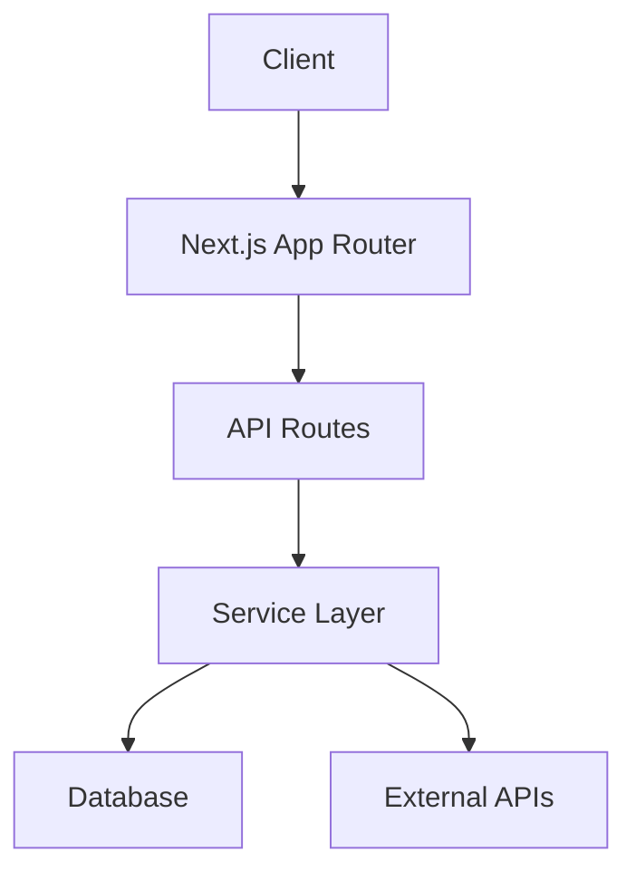

# Architecture Document Template

*The living document of your system's architecture. Updated when ADRs change the architecture, not on a schedule. Agents read this to understand the big picture.*

**This document vs. [ADRs](adr.md) — the split that keeps both useful:**

| | This document | An ADR |
|---|---|---|
| Answers | **what** the system is | **why** it is that way |
| Tense | present — "the system is X" | past — "on `<date>` we chose X" |
| Mutability | rewritten continuously | **immutable once accepted**; superseded, never edited |
| Count | exactly one | many, numbered, append-only |
| Read | every time an agent orients | on demand, when a decision is questioned |

Practically: this file is the **compressed, always-loaded view**; ADRs are
**just-in-time retrieval**. An agent implementing a ticket needs "where does DB
access live" (one read here), not 2,000 words on why Prisma was rejected. Keep
the rationale out of here and the shape out of the ADRs, and each stays cheap to
load ([Layer 0](../repo-memory.md)).

**The rule for which one to write:** *write an ADR the moment you reject a
credible alternative.* If nothing real was rejected, it isn't a decision — it's
a structural fact, and facts live **here** and nowhere else.

---

```markdown
# Architecture

<!-- last_verified: YYYY-MM-DD -->

## Architecture style

[E.g., "Hexagonal architecture with ports and adapters." One sentence.]

## High-level diagram



## Layer responsibilities

| Layer | Path | Responsibility | Must not |
|---|---|---|---|
| Routes / Handlers | `src/app/api/` | HTTP concerns: parsing, validation, response formatting | Business logic, direct DB access |
| Services | `src/server/<domain>/service.ts` | Business logic, orchestration | HTTP concerns, direct UI rendering |
| Data access | `src/server/db/` | Queries, migrations, schema | Business logic |
| Components | `src/components/` | UI rendering, user interaction | Data fetching (use hooks), business logic |

## Key design decisions

<!-- One line each: the decision AS IT STANDS TODAY, plus its ADR.
     The "why" lives in the ADR, not here. If you catch yourself explaining
     rationale or listing rejected alternatives in this section, it belongs in
     the ADR and this line should shrink back to a pointer. Two answers to
     "why" means neither is trustworthy. -->

1. **[Decision]** — [what holds today, one line] ([ADR-NNNN](../adr/NNNN-slug.md))
2. **[Decision]** — [what holds today, one line] ([ADR-NNNN](../adr/NNNN-slug.md))
3. **[Structural fact, no ADR]** — [no credible alternative was rejected, so
   there is no decision record; this line is the only home for it]

## Data flow

[How data moves through the system. E.g., "User request → Route handler validates with Zod → calls Service → Service queries DB via Drizzle → returns typed response → Route formats and returns."]

## Technology decisions

See [ADR-0001](../adr/0001-tech-stack.md) for the full rationale. Key points:

- [Technology]: [Why]
- ...

## Constraints

[Things the architecture deliberately prevents. "No direct database access from route handlers." "No business logic in components." "All cross-boundary communication goes through defined ports."]

## ADR index

| ADR | Decision | Status |
|---|---|---|
| [ADR-0001](../adr/0001-tech-stack.md) | Tech stack | accepted |
| [ADR-0002](../adr/0002-architecture-style.md) | Architecture style | accepted |
| ... | | |

## Known technical debt

| Item | Impact | Mitigation | Ticket |
|---|---|---|---|
| [Example: `serializeRow` doesn't handle BOM] | Unicode CSV exports may break | Fixed when export module is refactored | #241 |

## Revision history

| Date | Change | Author |
|---|---|---|
| YYYY-MM-DD | [What changed] | [Who] |
```

---

*Save as `docs/architecture/architecture.md`. Updated when ADRs change the architecture. Verified monthly per [memory-freshness-protocol.md](../memory-freshness-protocol.md).*

*Note: links **inside** the template body above are relative to the template's
destination (`docs/architecture/`), not to this repo — so `../adr/…` is correct
there and will not resolve here.*
