# Visual Appendix — Shareable Diagrams

*All diagrams in Mermaid format. Paste into any Mermaid-compatible renderer (GitHub, Notion, Obsidian, mermaid.live, VS Code plugin). This is the one doc to send teammates.*

---

## 1. The Full Lifecycle (S0 → S9)

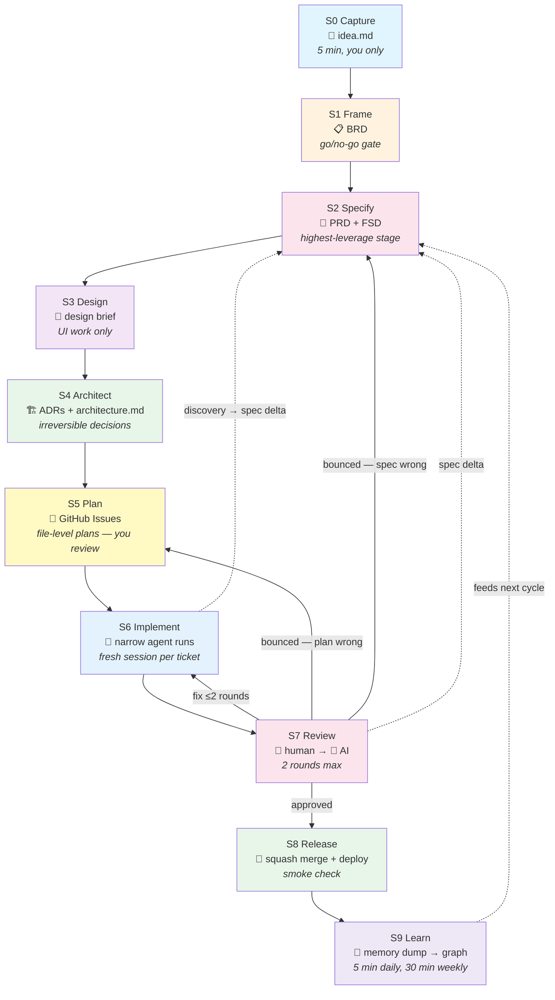

---

## 2. The Three Control Loops

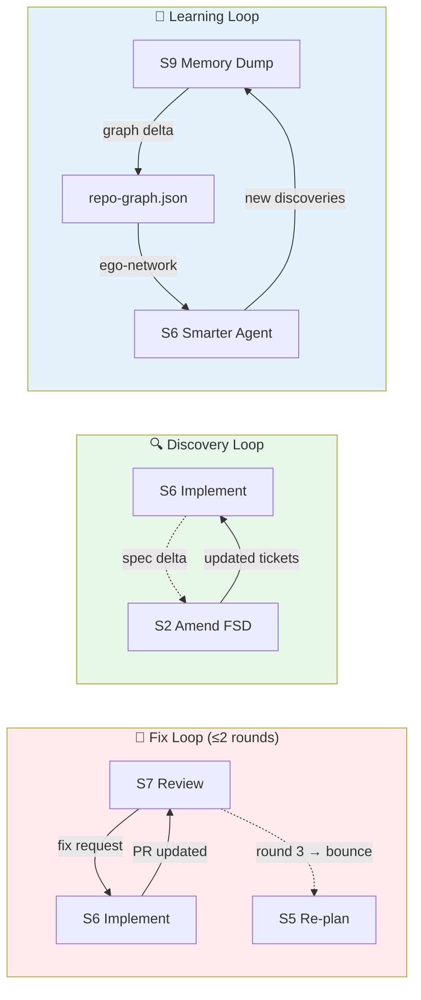

---

## 3. The Two-Stage Review Pipeline

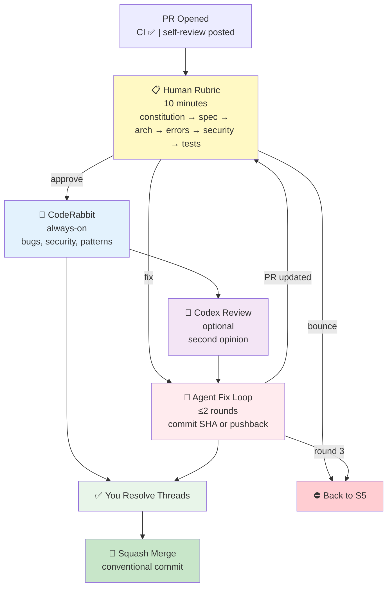

---

## 4. The Four-Layer Memory Architecture

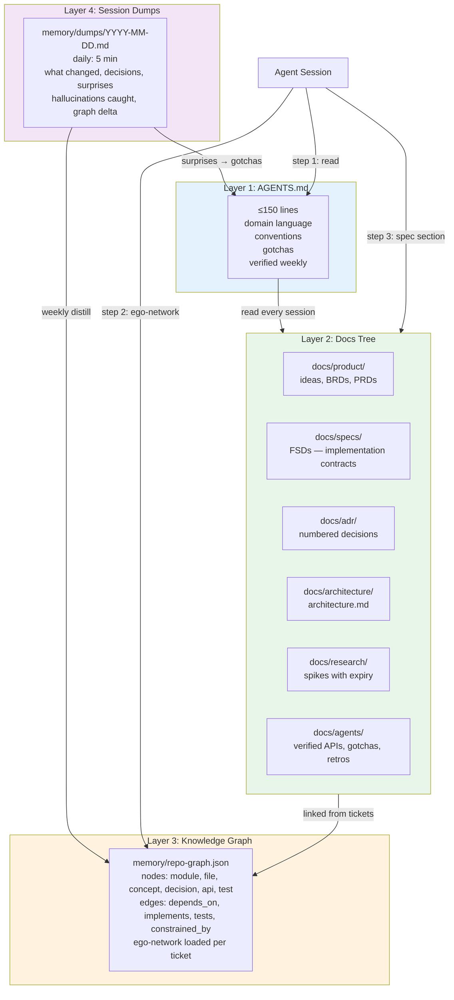

---

## 5. The Daily → Weekly → Monthly Cadence

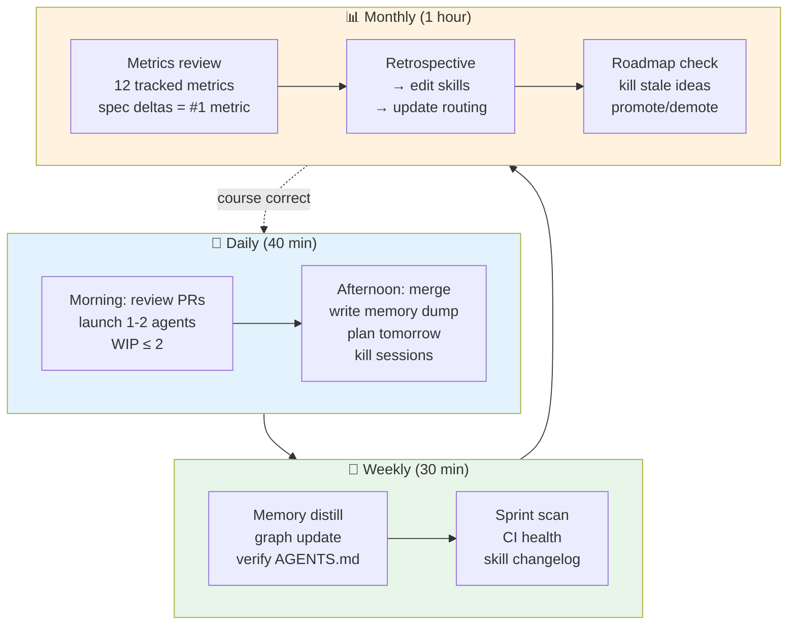

---

## 6. Tool Assignments per Stage

```mermaid
flowchart LR
    subgraph S0S4["S0–S4: Specification"]
        direction TB
        S02["S0: none / Claude chat"]
        S12["S1: Claude Code"]
        S22["S2: Claude Code (Opus)"]
        S32["S3: Claude Code + Figma MCP"]
        S42["S4: Claude Code (plan mode)"]
    end

    subgraph S5S6["S5–S6: Execution"]
        direction TB
        S52["S5: Claude Code + to-tickets<br/>alt: Spec Kit"]
        S62["S6: Claude Code (Sonnet)<br/>alt: Codex (2nd opinion)"]
        S6X["S6 XS async: Claude Code Web<br/>/ Copilot coding agent / Codex Web"]
    end

    subgraph S7S9["S7–S9: Quality & Learn"]
        direction TB
        S72["S7: You (rubric) → CodeRabbit<br/>→ Codex review (optional)"]
        S82["S8: CI/CD (Vercel / GH Actions)"]
        S92["S9: Claude Code (Haiku)<br/>memory-dump → graph-update"]
    end

    S0S4 --> S5S6 --> S7S9

    style S22 fill:#fce4ec
    style S62 fill:#e3f2fd
    style S72 fill:#fff9c4
```

---

## 7. Harness Decision Tree

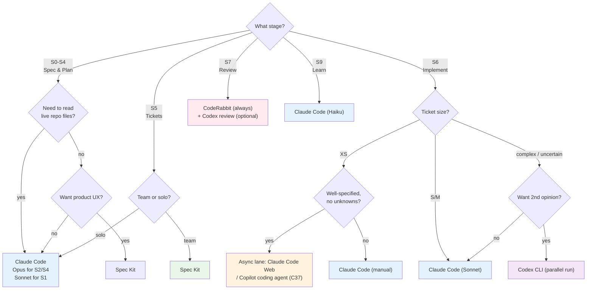

---

## 8. Memory Freshness — Verification Schedule

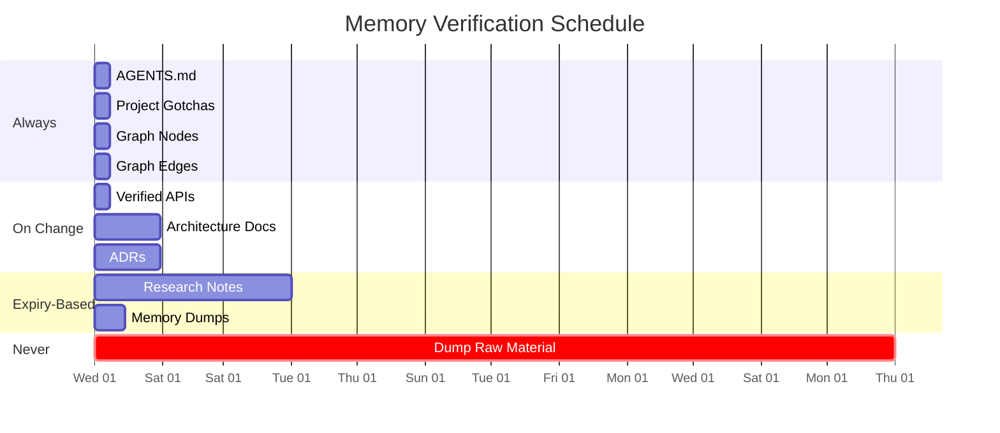

---

## 9. Failure Mode Taxonomy

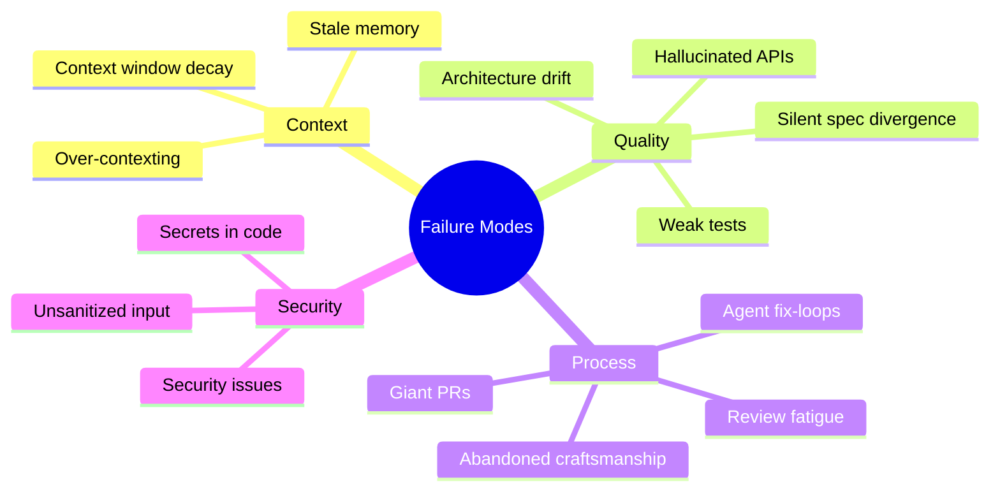

---

## 10. The Agent Constitution — Rule Categories

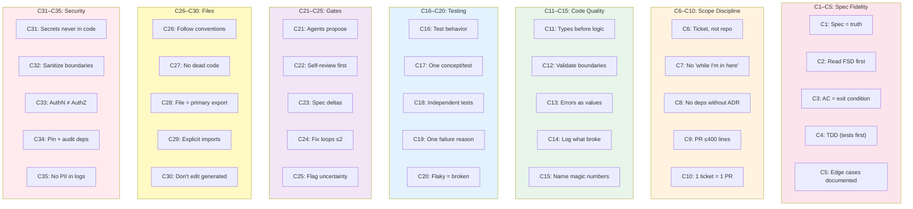

---

## 11. Walkthrough: New Feature (idea → merged PR)

```mermaid
flowchart LR
    subgraph day1["Day 1: Specify"]
        S01["S0: 5 min<br/>idea.md"]
        S11["S1: 30 min<br/>BRD + grill"]
        S21["S2: 1-2 hours<br/>PRD + FSD + grill-with-docs"]
    end

    subgraph day2["Day 2: Plan"]
        S32["S3: 20 min<br/>design brief"]
        S42["S4: 1 hour<br/>ADRs + architecture"]
        S52["S5: 1-2 hours<br/>to-tickets → Issues<br/>★ YOU REVIEW PLANS ★"]
    end

    subgraph day3["Day 3: Build & Ship"]
        S62["S6 morning<br/>launch agent on #231<br/>WIP = 2"]
        S72["S6 afternoon + S7<br/>self-review → rubric<br/>→ CodeRabbit → merge"]
        S82["S8: deploy<br/>smoke check"]
        S92["S9: 5 min dump"]
    end

    day1 --> day2 --> day3

    style day1 fill:#e3f2fd
    style day2 fill:#fff9c4
    style day3 fill:#e8f5e9
```

---

## 12. Walkthrough: Bug (report → regression test)

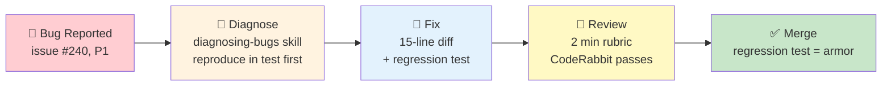

---

## 13. Walkthrough: Large Refactor (campaign, not ticket)

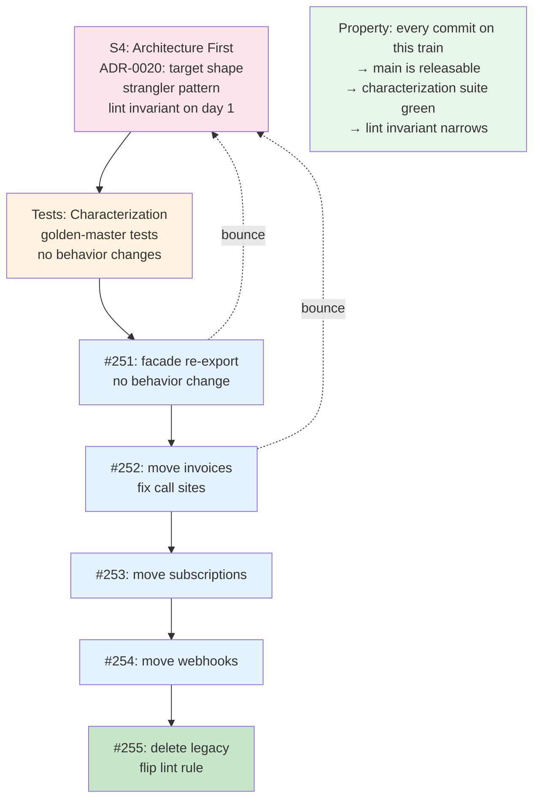

---

## 14. The Three Adoption Profiles

```mermaid
flowchart TD
    subgraph light["⚡ Lightweight"]
        L1["Skip: BRD, PRD, FSD doc"]
        L2["Keep: 1 issue = 1 PR"]
        L3["Keep: file-level plan in issue"]
        L4["Keep: human diff review"]
        L5["Keep: tests before merge"]
        L6["Skip: graph updates"]
    end

    subgraph default["🌟 Default (Recommended)"]
        D1["All stages as documented"]
        D2["BRD can be half-page"]
        D3["FSD + file-level plans never skipped"]
        D4["Full review pipeline"]
        D5["Memory system active"]
    end

    subgraph heavy["🏢 Heavyweight"]
        H1["All Default +"]
        H2["BMAD-style role separation"]
        H3["2 human reviewers on main"]
        H4["Compliance layer (SAST, DORA)"]
        H5["Shared memory governance"]
        H6["Merge queue on"]
    end

    light -->|"prototype graduates"| default
    default -->|"team grows"| heavy
    heavy -->|"burnout → scale back"| default

    style light fill:#e8f5e9
    style default fill:#e3f2fd
    style heavy fill:#fce4ec
```

---

## 15. Cost & Model Routing

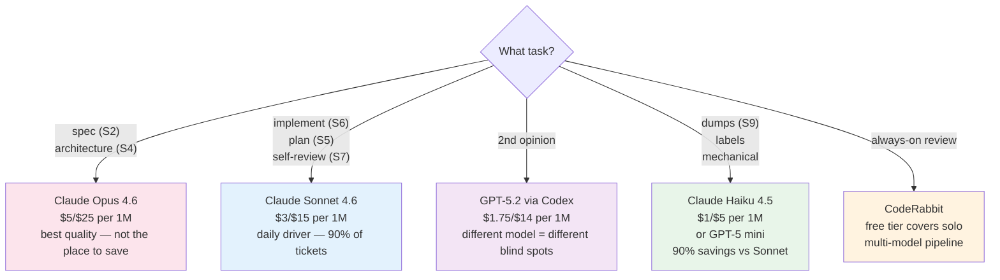

---

## 16. Repo Layout (What Goes Where)

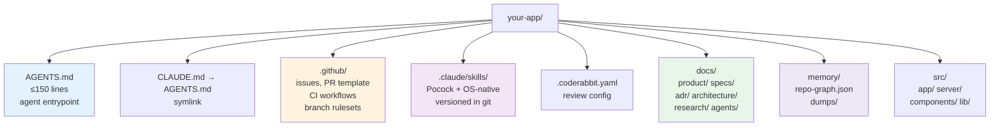

---

## How to use this appendix

1. **Share with team:** Send `visual-appendix.md`. GitHub renders Mermaid natively — every diagram is visible inline on github.com.
2. **Paste into tools:** Copy any diagram into [mermaid.live](https://mermaid.live) for editing and PNG/SVG export, Notion (paste as Mermaid block), Obsidian (with Mermaid plugin), or VS Code (Markdown Preview Mermaid extension).
3. **Print:** Export the lifecycle diagram (#1) as a poster for the wall. Export the daily cadence (#5) as a desk reference.
4. **Present:** Walk through diagrams #1, #3, #4, and #7 in order for a 15-minute overview of the system.

---

*Diagrams updated alongside the documentation they reference. If a doc changes, check if the visual needs updating. Mermaid syntax is intentionally simple — no custom CSS, no external dependencies.*
