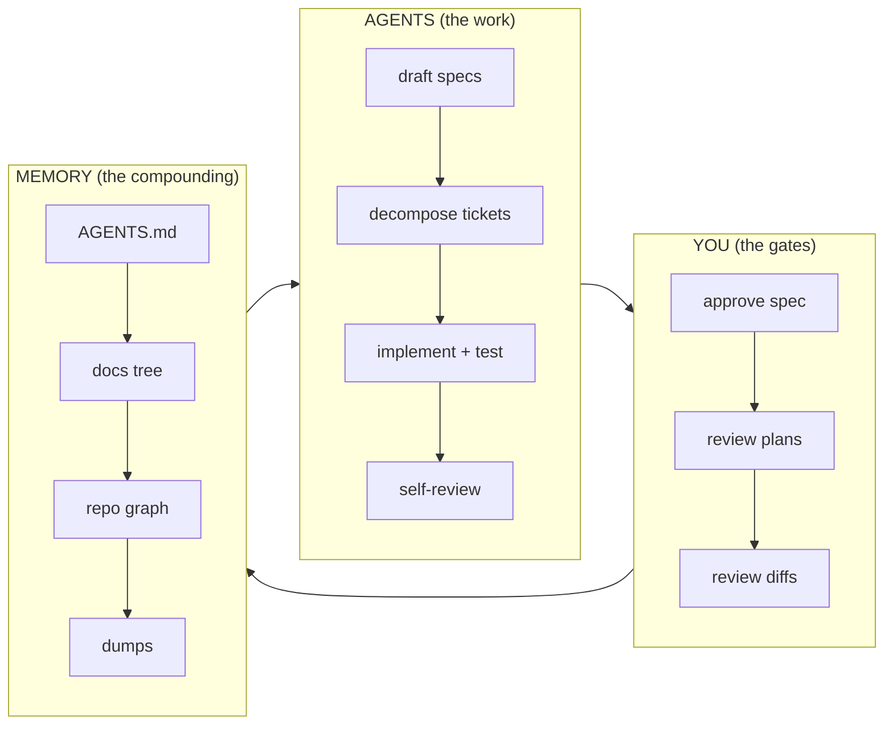

# Architect OS Wiki

*The user manual. The [README](../README.md) tells you what the OS is; this wiki tells you what to do with your hands. Every page links to the canonical doc instead of restating it — if this wiki ever disagrees with a canonical doc, the doc wins and the wiki has a bug.*

## Pages

| Page | Read it when |
|---|---|
| [01 — Getting Started](01-getting-started.md) | Day 0: installing the OS on a machine, then on a repo |
| [02 — Running the Loop](02-running-the-loop.md) | Day 1+: what you actually do — per day, per feature, per bug |
| [03 — Project Profiles](03-project-profiles.md) | Setting up Flutter vs web vs anything else — per-type customization |
| [04 — Reference Card](04-reference.md) | Any time: the numbers, gates, labels, and rules on one page |

## The system in one diagram

Your time concentrates at three gates — spec approval (S2), plan review (S5), diff review (S7). Agents do everything between gates. Memory makes every cycle smarter than the last. That's the whole system; the rest is mechanism.

## Canonical documents (the law)

[lifecycle.md](../lifecycle.md) · [constitution.md](../constitution.md) (C1–C37) · [daily-loop.md](../daily-loop.md) · [pr-review-rubric.md](../pr-review-rubric.md) · [review-workflow.md](../review-workflow.md) · [repo-memory.md](../repo-memory.md) · [memory-freshness-protocol.md](../memory-freshness-protocol.md) · [harness-matrix.md](../harness-matrix.md) · [models-cost-quality.md](../models-cost-quality.md) · [cost-control.md](../cost-control.md) · [rituals-and-metrics.md](../rituals-and-metrics.md) · [failure-modes.md](../failure-modes.md) · [failure-recovery-playbook.md](../failure-recovery-playbook.md) · [adoption-plan.md](../adoption-plan.md) · [tech-stack.md](../tech-stack.md) · [skills-catalog.md](../skills-catalog.md) · [profiles/](../profiles/README.md) · [visual-appendix.md](../visual-appendix.md)
